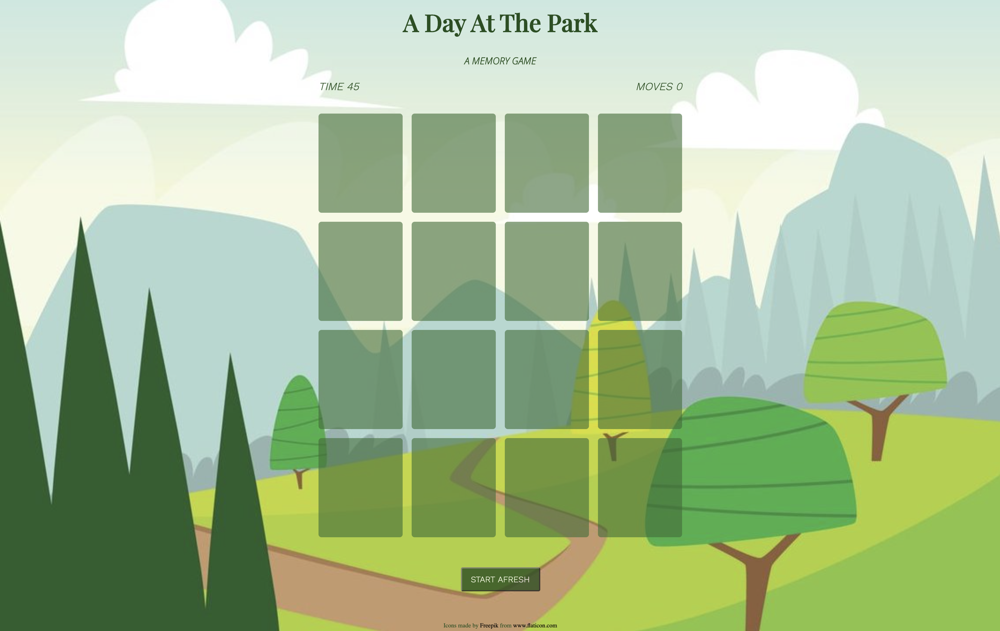
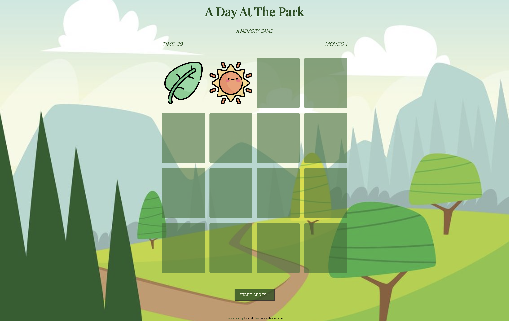
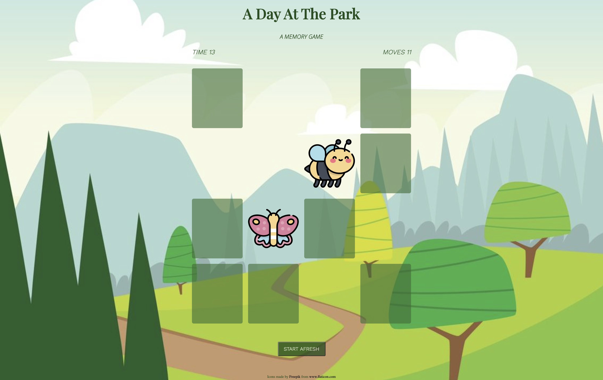

# A Day At The Park

## URL

<a href="https://jellybellyy.github.io/a-day-at-the-park/">https://jellybellyy.github.io/a-day-at-the-park</a>

## Description & Instructions

This is a simple pattern matching game. It is a card game in which all of the cards are laid face down on a surface and two cards are flipped face up over each turn. The objective of the game is to turn over all the matching pairs of cards within 50 seconds. If you fail to do so, you can simply start afresh and go again!

An interactive browser game made with html, css, and javascript.

## Screenshots

